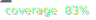

# HALO




A causal audit of forgetting in [Co-LMLM](https://arxiv.org/abs/2607.07707),
where facts are stored as free-form text in a dense memory and retrieved with
continuous keys. It builds on the earlier relational-LMLM audit
([*Auditing Forgetting in Limited Memory Language Models*](https://arxiv.org/abs/2607.00605)).

## What are we testing?

LMLMs are designed to keep factual knowledge in an external memory. In theory,
deleting a fact from that memory should make the model forget it. In practice,
the answer may still be available through the model's parameters or through a
different, related memory entry.

For each fact, we run the model in three settings:

- `FULL`: the memory is unchanged and retrieval is enabled.
- `DEL-ON`: the target entry is hidden, but retrieval remains enabled.
- `DEL-OFF`: the target entry is hidden and retrieval is disabled.

Comparing these runs helps us distinguish parametric memory from answers that
are recovered through retrieval. The audit also saves the retrieved entries so
we can inspect where an answer came from.

## Current status

The audit supports:

- a Co-LMLM backend built on the public model and index interfaces, behind a
  registry so additional models can be added without touching the audit core;
- a schema-free audit format (facts need no subject-relation pairs);
- non-destructive deletion (filtering selected entry or source IDs at search
  time), retrieval traces, query-embedding sidecars, and the cross-state
  forgetting metrics L(f) and R(f);
- an oracle smoke-test mode that uses the entry retrieved during `FULL` as the
  deletion target;
- materialized deletion closures (`--closure geometric,semantic,provenance`)
  built from the `FULL` pass, with per-entry attribution artifacts and a
  run-time semantic backstop;
- entanglement sweeps (`--radius-grid 0.95:0.70:0.05`) that measure deletion
  efficacy against collateral damage on neighbor facts
  (`--neighbor-mode cosine|same-source`) and report per-fact operating curves
  and the entanglement gap G(f);
- a representational-leakage probe (run automatically as part of an audit)
  that fits a linear readout on frozen query embeddings over a fact-disjoint
  split and reports L_rep and Δ_rep against the behavioral DEL-OFF baseline;
- an adversarial-closure evaluation (`--adversarial`) that injects synthetic
  survivor entries just outside the deletion radius, reports the evasion rate
  Ev(ρ, ε) per value template and topology, and scores a geometry-only margin
  predictor (AUROC) for retrieval-mediated leakage.

The Co-LMLM backend is unit-tested but has not yet been run against the full
released checkpoint and index. The closure's semantic and provenance predicates
begin to address the research goal of identifying all memory entries that
express a fact, rather than a single oracle entry.

## Repository structure

The code separates the model-agnostic audit from the model backends:

- `src/halo/` — the audit itself, which knows nothing about any specific
  model:
  - `core/` — the abstract backend interface, database states, forgetting
    metrics, entanglement/probe/neighbor analysis, answer-equivalence, and
    prompt/example handling.
  - `interventions/` — the backend-agnostic deletion and attack machinery:
    the deletion closure, the non-destructive filtering search, the support
    judge, and the adversarial survivor construction. These operate on any
    model through a generic search-index interface.
  - `registry.py` — the backend registry the CLI dispatches through.
  - `cli/` — the `halo-audit` entry point, the audit runner, and reporting.
- `src/models/` — one subpackage per audited model. Each follows the same
  template so models stay consistent, and each registers a backend with
  `halo.registry`, so a new model slots in with no changes to the audit
  core:
  - `__init__.py` — registers the model's `BackendSpec` (how to build the
    backend, its search index, job grouping, and argument validation).
  - `backend.py` — the `*AuditBackend` class (implements `generate`), loading,
    and output parsing.
  - `adapter.py` — how the model plugs into the audit's deletion/search
    machinery: `build_search_index` and any support-judge override.

## Setup

The project uses Python 3.12 and [uv](https://docs.astral.sh/uv/):

```bash
uv sync
uv run pytest
```

## Running the Co-LMLM audit

First fetch the PopQA audit prompts and the wiki index (`INDEX_DIR` overrides
the location; the index bucket is ~113 GB into `data/`, so run this where you
have the disk):

```bash
./scripts/setup_data.sh
```

The model is not downloaded here — the loader fetches the released
`lil-lab/CoLMLM-360M-FW` from Hugging Face on first use. Then, from the public
Co-LMLM checkout (Co-LMLM ships its own package named `lmlm`, so keep it in its
own environment):

```bash
cd /path/to/Co-LMLM

PYTHONPATH=/path/to/halo/src:src \
uv run python -m halo.run_audit \
  --backend co-lmlm \
  --index-path /path/to/halo/data/co-lmlm-wiki-index \
  --prompt-files /path/to/halo/data/prompts.jsonl \
  --bootstrap-oracle-from-full \
  --output-dir /path/to/results
```

`--index-path` is the memory/database being audited; `entries.db` is read from
inside it. The model and Co-LMLM source location are fixed in
`models/co_lmlm/__init__.py`.

The audit always runs all three states (`FULL`, `DEL-ON`, `DEL-OFF`) and
auto-detects device, dtype, and attention implementation — there are no flags
for those.

An example prompt file is available at
[data/colmlm/prompts_smoke.example.jsonl](data/colmlm/prompts_smoke.example.jsonl).
For a proper experiment, each prompt should use a reviewed deletion manifest
rather than relying on the oracle bootstrap option.

For the full FineWeb-Edu + Wikipedia index, the backend memory-maps the ~59 GB
FAISS file by default (set `LMLM_FAISS_MMAP=0` to force it into RAM) and
auto-uses the SQLite faiss-id mapping when a `.db` ships alongside the index.
Use `--nprobe` to raise IVF recall (the geometric closure depends on
approximate IVFPQ search; the value used is recorded in each closure manifest).

## Sweeps, closures, and the adversarial evaluation

`--closure`, `--radius-grid`, and `--adversarial` attach to the same
`halo-audit` command. For example, an entanglement sweep:

```bash
... run_audit --backend co-lmlm --index-path data/co-lmlm-wiki-index \
  --prompt-files data/prompts.jsonl --bootstrap-oracle-from-full \
  --closure geometric,semantic \
  --radius-grid 0.95:0.70:0.05 \
  --neighbor-mode cosine \
  --output-dir outputs/sweep
```

## Representational-leakage probe

A standard audit run automatically fits the representational-leakage probe on
its own FULL query embeddings (offline, no GPU, no extra command) and writes
`<prompt>_probe_per_fact.csv` and `<prompt>_probe_summary.csv` next to the
results — reporting L_rep, the behavioral DEL-OFF baseline L, and Δ_rep. It is
skipped for prompt files with too few facts to fit a fact-disjoint probe.

## Papers

- [Auditing Forgetting in Limited Memory Language Models](https://arxiv.org/abs/2607.00605)
- [Pre-training Limited Memory Language Models with Internal and External
  Knowledge](https://arxiv.org/abs/2505.15962)
- [Co-LMLM](https://arxiv.org/abs/2607.07707)

## Citation

```bibtex
@misc{lmlmauditing,
  title         = {Auditing Forgetting in Limited Memory Language Models},
  author        = {Raeesi, Arya and Roed, Hanna},
  year          = {2026},
  eprint        = {2607.00605},
  archivePrefix = {arXiv},
  primaryClass  = {cs.CL},
  url           = {https://arxiv.org/abs/2607.00605},
  doi           = {10.48550/arXiv.2607.00605}
}
```

## License

This project is licensed under the [MIT License](LICENSE).
